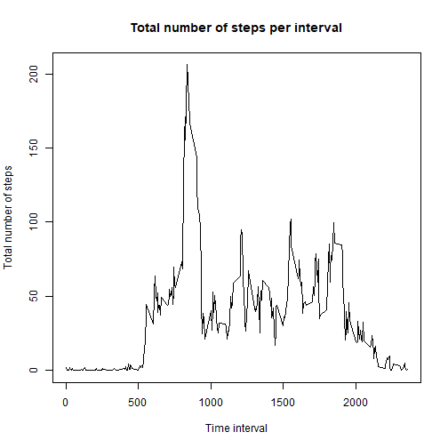

# **Course project assignement 1**

## 1. Code for reading and processing the data


```r
activity<-read.csv('./activity.csv',stringsAsFactors = FALSE)
activity$date<-as.Date(activity$date)
```

## 2. Histogram of the total number of steps taken each day

We first aggregate the total number of steps per day and then plot it with the ggplot package

```r
library(plyr)
steps_day<-ddply(activity,~ date,summarise,steps=sum(steps,na.rm=TRUE))

library(ggplot2)
ggplot(steps_day,aes(x=date,y=steps)) + geom_histogram(stat = "identity")+xlab("Day") + ylab("Total steps")+ggtitle("Total number of steps taken per day")
```

```
## Warning: Ignoring unknown parameters: binwidth, bins, pad
```


## 3. Mean and median number of steps taken each day

```r
mean_steps_day<-round(mean(steps_day$steps,na.rm=TRUE),0)
median_steps_day<-median(steps_day$steps,na.rm=TRUE)
```
The mean of the total number of steps taken per day is 9354 steps  
The median of the total number of steps taken per day is 10395 steps  

## 4. Time series plot of the average number of steps taken
We first aggregate the average number of steps taken accross all days per 5-minute interval and then plot it with the ggplot package

```r
library(plyr)
average_activity<-ddply(activity,~ interval,summarise,average_steps=mean(steps,na.rm=TRUE))

par(mfrow=c(1,1))
plot(x=average_activity$interval,y=average_activity$average_steps,type="l",xlab="Time interval",ylab="Total number of steps",main="Total number of steps per interval")
```



## 5. The 5-minute interval that, on average, contains the maximum number of steps

```r
max_average_steps<-max(average_activity$average_steps,na.rm=TRUE)
max_average_steps_interval<-average_activity[average_activity$average_steps==max_average_steps,c("interval")]
max_average_steps_rounded<-round(max(average_activity$average_steps,na.rm=TRUE),0)
```
On average across all the days in the dataset, it is the 835th interval that contains the maximum number of steps with 206steps

## 6. Code to describe and show a strategy for imputing missing data
We first count the number of missig values

```r
number_missing_values<-length(activity[is.na(activity$steps)==TRUE,c("steps")])
```
There are 2304missing values in the dataset.

Then we create a second dataset with no missing values. The NA values will be replaced by the average value for the 5-minute interval


```r
activity_enriched<-activity
for(i in 1:length(activity_enriched$steps)) {
        if (is.na(activity_enriched$steps[i])==TRUE) {
             activity_enriched$steps[i]<-average_activity[average_activity$interval==activity_enriched$interval[i],c("average_steps")]
}
}
```

## 7. Histogram of the total number of steps taken each day after missing values are imputed

We first make an histogram of the total number of steps aken each day wih the missing values imputed


```r
library(plyr)
steps_day_enriched<-ddply(activity_enriched,~ date,summarise,steps=sum(steps))

library(ggplot2)
ggplot(steps_day_enriched,aes(x=date,y=steps)) + geom_histogram(stat = "identity")+xlab("Day") + ylab("Total steps")+ggtitle("Total number of steps taken per day after imputing missing values")
```

```
## Warning: Ignoring unknown parameters: binwidth, bins, pad
```


Then we calculate and report the mean and median total number of steps taken per day with the missing values imputed


```r
mean_steps_day_enriched<-round(mean(steps_day_enriched$steps,na.rm=TRUE),0)
median_steps_day_enriched<-round(median(steps_day_enriched$steps,na.rm=TRUE),0)
```
The mean of the total number of steps taken per day with the missing values imputed is 1.0766 &times; 10<sup>4</sup> steps  
The median of the total number of steps taken per day with the missing values imputed is 1.0766 &times; 10<sup>4</sup> steps  

Comparing the values with and without consideration of the missing values

```r
comparison_mean<-round(mean_steps_day_enriched - mean_steps_day,0)
comparison_median<-round(median_steps_day_enriched-median_steps_day,0)
```
Those parameters are higher than what was estimated during the first part of the assignement. The new average is 1412 higher and the median is 371 higher

## 8. Panel plot comparing the average number of steps taken per 5-minute interval across weekdays and weekends

We first create a new factor variable in the dataset with two levels ("weekday" and "weekend")

```r
activity_enriched$weekday<-weekdays(activity_enriched$date)

for(i in 1:length(activity_enriched$steps)) {
        if (activity_enriched$weekday[i]=="dimanche" |activity_enriched$weekday[i]=="samedi") {
                activity_enriched$factor[i]<-"Weekend" 
        }
        else { activity_enriched$factor[i]<-"Weekday"}
}
```

Then we make a panel plot comparing weekdays average and weekends average

```r
library(plyr)
average_activity_weekdays<-ddply(activity_enriched[activity_enriched$factor=="Weekday",],~ interval,summarise,average_steps=mean(steps,na.rm=TRUE))

average_activity_weekends<-ddply(activity_enriched[activity_enriched$factor=="Weekend",],~ interval,summarise,average_steps=mean(steps,na.rm=TRUE))

par(mfrow=c(2,1))
plot(x=average_activity_weekends$interval,y=average_activity_weekends$average_steps,type="l",xlab="Time interval",ylab="Total number of steps",main="Weekends")

plot(x=average_activity_weekdays$interval,y=average_activity_weekdays$average_steps,type="l",xlab="Time interval",ylab="Total number of steps",main="Weekdays")
```


